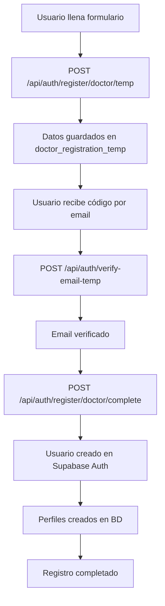

# Flujo de Registro de Médicos con Verificación de Email

## Resumen

Este documento describe el nuevo flujo profesional de registro de médicos que implementa verificación de correo electrónico antes de crear la cuenta en Supabase. El sistema utiliza almacenamiento temporal de datos y un proceso de verificación robusto.

## Arquitectura del Sistema

### Componentes Principales

1. **Almacenamiento Temporal** (`doctor_registration_temp`)
2. **Sistema de Verificación** (`email_verification_codes_temp`)
3. **APIs de Registro** (temporal y final)
4. **Hook Personalizado** (`useDoctorRegistrationWithVerification`)
5. **Componentes de UI** (formulario y verificación)

### Flujo de Datos



## Base de Datos

### Tablas Creadas

#### `doctor_registration_temp`
Almacena datos de registro temporalmente antes de la verificación.

```sql
CREATE TABLE doctor_registration_temp (
  id UUID PRIMARY KEY,
  email VARCHAR(255) UNIQUE NOT NULL,
  verification_token VARCHAR(255) UNIQUE NOT NULL,
  registration_data JSONB NOT NULL,
  status VARCHAR(50) DEFAULT 'pending_verification',
  email_verified_at TIMESTAMP WITH TIME ZONE,
  verification_attempts INTEGER DEFAULT 0,
  expires_at TIMESTAMP WITH TIME ZONE NOT NULL,
  created_at TIMESTAMP WITH TIME ZONE DEFAULT NOW(),
  updated_at TIMESTAMP WITH TIME ZONE DEFAULT NOW()
);
```

#### `email_verification_codes_temp`
Maneja códigos de verificación de email.

```sql
CREATE TABLE email_verification_codes_temp (
  id UUID PRIMARY KEY,
  registration_temp_id UUID REFERENCES doctor_registration_temp(id),
  email VARCHAR(255) NOT NULL,
  code VARCHAR(6) NOT NULL,
  attempts INTEGER DEFAULT 0,
  expires_at TIMESTAMP WITH TIME ZONE NOT NULL,
  used BOOLEAN DEFAULT FALSE,
  created_at TIMESTAMP WITH TIME ZONE DEFAULT NOW()
);
```

#### `registration_verification_logs`
Logs de auditoría para el proceso de verificación.

```sql
CREATE TABLE registration_verification_logs (
  id UUID PRIMARY KEY,
  registration_temp_id UUID REFERENCES doctor_registration_temp(id),
  action VARCHAR(100) NOT NULL,
  status VARCHAR(50) NOT NULL,
  ip_address INET,
  user_agent TEXT,
  metadata JSONB DEFAULT '{}',
  created_at TIMESTAMP WITH TIME ZONE DEFAULT NOW()
);
```

## APIs

### 1. Registro Temporal
**POST** `/api/auth/register/doctor/temp`

Crea un registro temporal con los datos del médico.

**Request:**
```json
{
  "firstName": "Juan",
  "lastName": "Pérez",
  "email": "juan@example.com",
  "phone": "+584121234567",
  "password": "password123",
  "specialtyId": "cardiology",
  "licenseNumber": "12345",
  "licenseState": "Venezuela",
  "licenseExpiry": "2025-12-31",
  "yearsOfExperience": 5,
  "bio": "Médico especialista en cardiología"
}
```

**Response:**
```json
{
  "success": true,
  "message": "Registro temporal creado exitosamente",
  "data": {
    "registration_id": "uuid",
    "verification_token": "reg_abc123",
    "expires_at": "2024-01-15T10:30:00Z",
    "email": "juan@example.com"
  }
}
```

### 2. Verificación de Email
**POST** `/api/auth/verify-email-temp`

Verifica el código de email enviado al usuario.

**Request:**
```json
{
  "email": "juan@example.com",
  "code": "123456",
  "registration_id": "uuid"
}
```

**Response:**
```json
{
  "success": true,
  "message": "Email verificado exitosamente",
  "data": {
    "email": "juan@example.com",
    "verified_at": "2024-01-15T10:35:00Z",
    "registration_data": { /* datos completos del registro */ }
  }
}
```

### 3. Registro Final
**POST** `/api/auth/register/doctor/complete`

Completa el registro creando el usuario en Supabase Auth.

**Request:**
```json
{
  "verification_token": "reg_abc123"
}
```

**Response:**
```json
{
  "success": true,
  "message": "Registro completado exitosamente",
  "data": {
    "user": {
      "id": "uuid",
      "email": "juan@example.com",
      "email_confirmed_at": "2024-01-15T10:40:00Z"
    },
    "profile": {
      "id": "uuid",
      "first_name": "Juan",
      "last_name": "Pérez",
      "role": "doctor"
    },
    "doctor": {
      "id": "uuid",
      "specialty_id": "cardiology",
      "license_number": "12345",
      "is_verified": false
    }
  }
}
```

## Hook Personalizado

### `useDoctorRegistrationWithVerification`

Hook que maneja todo el flujo de registro con verificación.

```typescript
const {
  currentStep,           // 'form' | 'verification' | 'completing' | 'completed'
  isLoading,            // boolean
  error,                // string | null
  verificationToken,    // string | null
  registrationData,     // DoctorRegistrationData | null
  
  submitRegistration,   // (data: DoctorRegistrationData) => Promise<void>
  verifyEmail,          // (email: string, code: string) => Promise<void>
  resendVerificationCode, // (email: string) => Promise<void>
  completeRegistration, // () => Promise<void>
  resetRegistration,    // () => void
  
  canProceedToVerification,    // boolean
  canCompleteRegistration,     // boolean
} = useDoctorRegistrationWithVerification();
```

## Componentes de UI

### 1. `DoctorRegistrationWithVerification`
Componente principal que integra todo el flujo.

```tsx
<DoctorRegistrationWithVerification
  onSuccess={() => router.push('/doctor/dashboard')}
  onCancel={() => router.back()}
/>
```

### 2. `EmailVerificationStep`
Componente específico para la verificación de email.

```tsx
<EmailVerificationStep
  email="juan@example.com"
  onVerificationSuccess={handleVerification}
  onResendCode={handleResend}
  isLoading={false}
  error={null}
  canResend={true}
  resendCooldown={0}
/>
```

## Seguridad

### Medidas Implementadas

1. **Tokens únicos** para cada registro
2. **Expiración automática** de registros (48 horas)
3. **Límite de intentos** de verificación (3 intentos)
4. **Logs de auditoría** para todas las acciones
5. **Validación de datos** en cada paso
6. **Limpieza automática** de registros expirados

### Funciones de Seguridad

```sql
-- Limpiar registros expirados
SELECT cleanup_expired_registrations();

-- Generar token único
SELECT generate_verification_token();

-- Generar código de verificación
SELECT generate_verification_code();

-- Validar datos de registro
SELECT validate_doctor_registration_data('{"email": "test@example.com"}');
```

## Configuración

### Variables de Entorno

```env
# Supabase
NEXT_PUBLIC_SUPABASE_URL=your_supabase_url
NEXT_PUBLIC_SUPABASE_ANON_KEY=your_anon_key
SUPABASE_SERVICE_ROLE_KEY=your_service_role_key

# Email (opcional, para envío real de códigos)
SMTP_HOST=smtp.gmail.com
SMTP_PORT=587
SMTP_USER=your_email@gmail.com
SMTP_PASS=your_app_password
```

### Configuración de Supabase

1. **Habilitar RLS** en todas las tablas
2. **Configurar políticas** de seguridad
3. **Crear índices** para optimización
4. **Configurar triggers** para timestamps

## Monitoreo y Mantenimiento

### Logs de Seguridad

El sistema registra automáticamente:
- Inicio de registros
- Intentos de verificación
- Completación exitosa
- Errores y fallos
- Limpieza de registros expirados

### Métricas Importantes

- Tasa de conversión (formulario → verificación → completado)
- Tiempo promedio de verificación
- Número de reintentos por usuario
- Registros expirados vs completados

### Mantenimiento Regular

1. **Limpieza automática** de registros expirados
2. **Monitoreo** de logs de seguridad
3. **Análisis** de métricas de conversión
4. **Actualización** de políticas de seguridad

## Migración desde el Sistema Anterior

### Pasos de Migración

1. **Ejecutar migración** de base de datos
2. **Actualizar** componentes de registro
3. **Configurar** nuevas APIs
4. **Probar** flujo completo
5. **Monitorear** métricas

### Compatibilidad

- El sistema anterior sigue funcionando
- Los usuarios existentes no se ven afectados
- Migración gradual posible
- Rollback disponible si es necesario

## Troubleshooting

### Problemas Comunes

1. **Código de verificación no llega**
   - Verificar configuración SMTP
   - Revisar logs de email
   - Comprobar carpeta spam

2. **Registro expirado**
   - Verificar configuración de expiración
   - Limpiar registros expirados
   - Permitir nuevo registro

3. **Error en creación de usuario**
   - Verificar permisos de Supabase
   - Revisar logs de autenticación
   - Comprobar configuración de RLS

### Comandos de Diagnóstico

```sql
-- Ver registros activos
SELECT * FROM doctor_registration_temp 
WHERE expires_at > NOW() 
ORDER BY created_at DESC;

-- Ver códigos de verificación activos
SELECT * FROM email_verification_codes_temp 
WHERE expires_at > NOW() AND used = FALSE;

-- Ver logs recientes
SELECT * FROM registration_verification_logs 
ORDER BY created_at DESC 
LIMIT 100;

-- Estadísticas de registro
SELECT 
  status,
  COUNT(*) as count,
  AVG(EXTRACT(EPOCH FROM (updated_at - created_at))) as avg_duration_seconds
FROM doctor_registration_temp 
GROUP BY status;
```

## Conclusión

Este nuevo flujo de registro proporciona:

- ✅ **Seguridad mejorada** con verificación de email
- ✅ **Mejor experiencia de usuario** con feedback claro
- ✅ **Métricas detalladas** para monitoreo
- ✅ **Escalabilidad** para futuras mejoras
- ✅ **Mantenibilidad** con código bien estructurado

El sistema está listo para producción y puede manejar grandes volúmenes de registros de manera eficiente y segura.
