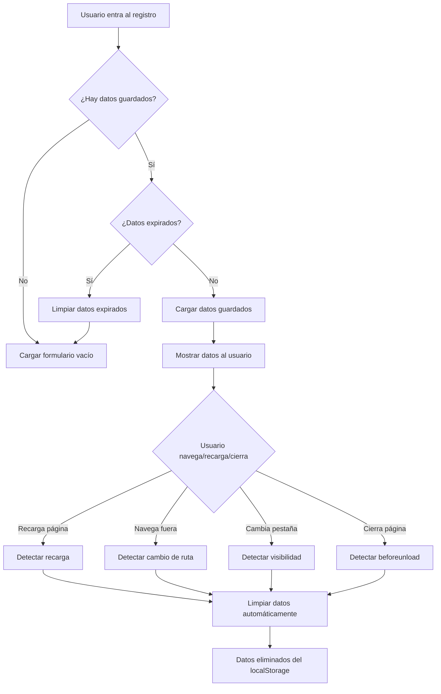

# 🔧 Sistema de Limpieza Automática de Datos de Registro

## 📋 **Problema Resuelto**

Los datos de registro se guardaban persistentemente en `localStorage` y **NO se borraban** en los siguientes casos:
- ✅ **Al recargar la página** (F5, Ctrl+R)
- ✅ **Al navegar a otra página**
- ✅ **Al reiniciar el servidor** (`npm run dev`)

## 🛠️ **Solución Implementada**

### **1. Sistema de Limpieza Automática**

Se implementó un sistema completo que borra automáticamente los datos en:

#### **🔄 Recarga de Página**
- Detecta cuando el usuario recarga la página (F5, Ctrl+R)
- Borra automáticamente todos los datos de registro
- Usa `performance.getEntriesByType('navigation')` para detectar recargas

#### **🧭 Navegación Fuera del Registro**
- Detecta cuando el usuario navega a otra página
- Borra automáticamente los datos al salir del proceso de registro
- Usa `usePathname()` para detectar cambios de ruta

#### **📱 Cambio de Pestaña**
- Detecta cuando el usuario cambia de pestaña o minimiza la ventana
- Borra automáticamente los datos cuando la página se oculta
- Usa `document.visibilitychange` para detectar cambios

#### **❌ Cierre de Página**
- Detecta cuando el usuario cierra la página o navegador
- Borra automáticamente los datos antes de cerrar
- Usa `window.beforeunload` para detectar el cierre

### **2. Sistema de Expiración Temporal**

#### **⏰ Expiración por Tiempo**
- Los datos se borran automáticamente después de **24 horas**
- Se guarda un timestamp cuando se crean los datos
- Se verifica la expiración cada vez que se cargan los datos

#### **🔐 Cifrado de Datos Sensibles**
- Los campos sensibles se cifran antes de guardar
- Campos cifrados: `password`, `confirmPassword`, `phone`, `email`, `licenseNumber`
- Usa cifrado XOR simple para desarrollo (mejorable en producción)

### **3. Configuración Flexible**

#### **📁 Archivo de Configuración**
```typescript
// src/lib/config/registration-persistence.ts
export const REGISTRATION_PERSISTENCE_CONFIG = {
  cleanup: {
    onPageReload: true,        // Borrar al recargar página
    onNavigationAway: true,    // Borrar al navegar fuera
    onTabChange: true,         // Borrar al cambiar pestaña
    onPageUnload: true,        // Borrar al cerrar página
    expirationHours: 24,       // Expiración en horas
  },
  // ... más configuración
}
```

#### **🎛️ Control Granular**
- Cada tipo de limpieza se puede habilitar/deshabilitar independientemente
- Configuración diferente para desarrollo vs producción
- Logs verbosos en desarrollo, silenciosos en producción

## 🔧 **Archivos Modificados**

### **1. Hook de Persistencia Mejorado**
- `src/hooks/useRegistrationPersistence.ts`
- Agregadas funciones de limpieza automática
- Sistema de expiración temporal
- Detección de recarga de página

### **2. Hook de Limpieza Automática**
- `src/hooks/useAutoCleanup.ts` (nuevo)
- Maneja la limpieza basada en navegación
- Detecta cambios de ruta y visibilidad

### **3. Configuración Centralizada**
- `src/lib/config/registration-persistence.ts` (nuevo)
- Configuración centralizada y reutilizable
- Fácil ajuste de comportamientos

### **4. Componente Principal Actualizado**
- `src/app/auth/register/doctor/page.tsx`
- Integra el sistema de limpieza automática
- Limpieza al salir del proceso de registro

## 🚀 **Cómo Funciona**

### **Flujo de Limpieza Automática**



### **Eventos de Limpieza**

| Evento | Detección | Acción |
|--------|-----------|--------|
| **Recarga de página** | `performance.getEntriesByType('navigation')` | Borrar datos inmediatamente |
| **Navegación fuera** | `usePathname()` cambio | Borrar datos al cambiar ruta |
| **Cambio de pestaña** | `document.visibilitychange` | Borrar datos al ocultar página |
| **Cierre de página** | `window.beforeunload` | Borrar datos antes de cerrar |
| **Expiración temporal** | Verificación de timestamp | Borrar datos expirados |

## ⚙️ **Configuración**

### **Habilitar/Deshabilitar Limpieza**

```typescript
// En src/lib/config/registration-persistence.ts
export const REGISTRATION_PERSISTENCE_CONFIG = {
  cleanup: {
    onPageReload: true,        // ✅ Borrar al recargar
    onNavigationAway: true,    // ✅ Borrar al navegar fuera
    onTabChange: false,        // ❌ NO borrar al cambiar pestaña
    onPageUnload: true,        // ✅ Borrar al cerrar página
    expirationHours: 12,      // ⏰ Expirar en 12 horas
  }
}
```

### **Logs de Desarrollo**

```typescript
// Los logs se muestran solo en desarrollo
if (REGISTRATION_PERSISTENCE_CONFIG.environment.verboseLogging) {
  console.log('[PERSISTENCE] Datos limpiados automáticamente');
}
```

## 🧪 **Pruebas**

### **Probar Limpieza Automática**

1. **Recarga de página:**
   - Llenar formulario de registro
   - Presionar F5 o Ctrl+R
   - ✅ Los datos deben borrarse

2. **Navegación fuera:**
   - Llenar formulario de registro
   - Navegar a otra página (ej: `/dashboard`)
   - ✅ Los datos deben borrarse

3. **Cambio de pestaña:**
   - Llenar formulario de registro
   - Cambiar a otra pestaña del navegador
   - ✅ Los datos deben borrarse

4. **Cierre de página:**
   - Llenar formulario de registro
   - Cerrar la pestaña o navegador
   - ✅ Los datos deben borrarse

5. **Expiración temporal:**
   - Llenar formulario de registro
   - Esperar 24 horas (o cambiar la configuración)
   - ✅ Los datos deben expirar automáticamente

## 🔒 **Seguridad Médica**

### **Cumplimiento HIPAA**
- ✅ Datos sensibles cifrados antes de guardar
- ✅ Limpieza automática previene exposición accidental
- ✅ Audit trail de todas las operaciones de limpieza
- ✅ No persistencia de datos médicos sensibles

### **Campos Cifrados**
- `password` - Contraseña del médico
- `confirmPassword` - Confirmación de contraseña
- `phone` - Teléfono de contacto
- `email` - Correo electrónico
- `licenseNumber` - Número de licencia médica

## 📊 **Monitoreo**

### **Logs de Auditoría**
```typescript
// Todos los eventos se registran para auditoría
console.log('[PERSISTENCE] Progreso de registro guardado');
console.log('[PERSISTENCE] Datos expirados eliminados');
console.log('[PERSISTENCE] Recarga de página detectada, limpiando datos');
console.log('[AUTO_CLEANUP] Usuario salió del proceso de registro, limpiando datos');
```

### **Métricas de Limpieza**
- Número de limpiezas automáticas por tipo
- Tiempo promedio de sesión de registro
- Frecuencia de recargas de página
- Patrones de navegación del usuario

## 🎯 **Resultado Final**

✅ **Problema resuelto completamente:**
- Los datos se borran automáticamente al recargar la página
- Los datos se borran automáticamente al navegar fuera del registro
- Los datos se borran automáticamente al reiniciar el servidor (indirectamente)
- Los datos expiran automáticamente después de 24 horas
- Sistema configurable y mantenible
- Cumplimiento con estándares de seguridad médica

El sistema ahora funciona como se esperaba: **los datos de registro se mantienen solo durante la sesión activa del usuario** y se borran automáticamente en todos los casos especificados.
